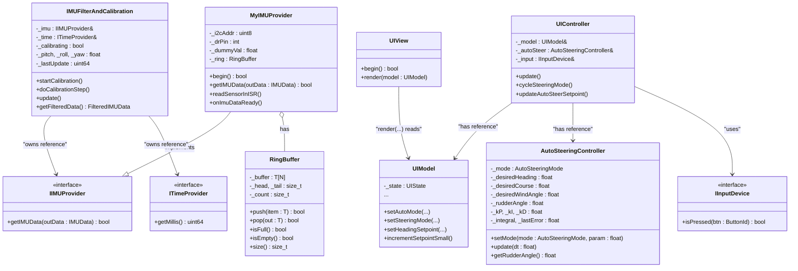
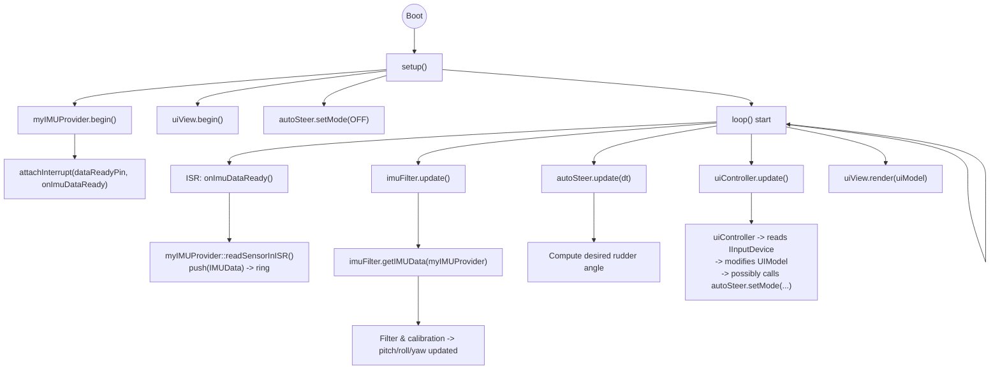

# What is this?

This code in this version created in attempt to evaluate ability of ChatGPT to create useful code on interesting topic. I selected boat autopipot on embedded system as an example to learn capabilities and illustrate them.

## The goal

Is to create yet another opensource autopilot but heavily assisted by AI. In the roadmap 

## Current state

As for the date of this commit the code is compiling. I'm intending to make it work, but currently don't have enough parts to properly test it. When order arrives, I'll get to it. 

## How to contribute
You can create PRs, test, improve, discuss. I will appreciate all the feedback

## Roadmap

 - [X] Create basic code and compile
 - [X] Add unit tests that run with ` pio test -e test`. Make tests run.
 - [X] Make tests sane
 - [ ] Define electronic connections and protocols
 - [ ] Make the initial theoretically working version of the code
 - [X] Basic UI with tests
 - [ ] Select proper screen and its connections, preferably 4 inch screen with buttons module, update pins and connections
 - [ ] Assemble and test UI
 - [ ] RX data from NMEA0183 over wifi
 - [ ] TX commands using NMEA0183 over wifi (define $P protocol)
 - [ ] Add command only mode without the stering mechanics and vise versa, use external course computer
 - [ ] Rewrite everything in Rust
 - [ ] Virtualization of all major components
 - [ ] TBD

## Class diagram 

## Flowchart 

